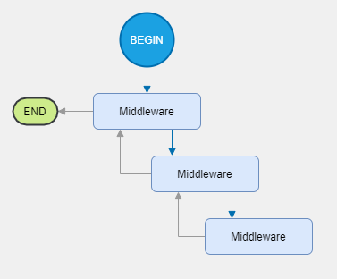

# vertical-pipelines

Generic "middleware" pipelines.


[](https://github.com/verticalsoftware/vertical-pipelines/actions/workflows/dev-build.yml)
[](https://github.com/verticalsoftware/vertical-pipelines/actions/workflows/release.yml)
[](https://codecov.io/gh/verticalsoftware/vertical-pipelines)

## Motivation

ASP.NET Core provides a middleware pipeline to handle HTTP requests. This micro library defines some types that enable you to construct logic pipelines of your own and control when they are invoked and the contextual data type that is available to the pipeline components.

## Features at a glance

- Implement middleware using classes or delegates
- Use application defined types to pass state around the middleware pipeline
- Integrate easily with dependency injection providers. 

## Usage

This library does its best to mimic the intent and familiar feel of [ASP.NET Core middleware](https://docs.microsoft.com/en-us/aspnet/core/fundamentals/middleware/?view=aspnetcore-5.0). The only nuance is scoped/per-request service dependencies, which is discussed in this article.

### Overview

> 📝 Note
> 
> Already intimately familiar with ASP.NET Core implementation of middleware? If so, you may be able to skip to the [dependency injection](#per-invocation-dependencies) section to see the nuance in this implementation.

A middleware pipeline is an ordered series of discrete tasks that cooperatively work to complete an activity. Middleware pipelines promote [separation of concerns](https://en.wikipedia.org/wiki/Separation_of_concerns) and reduces coupling of logic between steps of a complex workflow. In addition to performing discrete work, each step (middleware) controls when and if control is transferred to the next step. A middleware pipeline should also be extensible, in that you should be be able to easily add and remove functionality from the pipeline with *configuration* and not rely on having to modify the middleware steps themselves.

This illustrates a middleware pipeline. Notice the middleware is structured like a linked list of sorts. Control flow begins where indicated, and travels through the middleware components as if they were simple functions that call each other in succession.



### The Pipeline Delegate

The framework defines the following delegate type:

```csharp
public delegate Task PipelineDelegate<in TContext>(TContext request);
```

This delegate receives a context object, performs work, and returns a Task to indicate when it is complete. The `TContext` type is defined by the application, and can be any type. The application can have multiple pipelines, each with a different context type. Although any type is acceptable, carefully consider the use of structs due to the fact that the delegate does not support by-reference semtantics.

### Building a pipeline

Pipelines can be constructed using the `IPipelineBuilder<TContext>` interface. Essentially you create a builder object, register the middleware steps that participate in the pipeline, then build a delegate that is called to invoke the pipeline.

```csharp
// An extremely silly example... let's say we have a pipeline that 
// doubles a number, then adds 10 to it.

public class MathOperationRequest
{
    public int Value { get; set; }
}

// Create a pipeline builder
var builder = new PipelineBuilder<MathOperationRequest>();

// The "double the value" step
builder.Use(next => request => 
{
    request *= 2;
    return next(request);
});

// The "add 10" step
builder.Use(next => request =>
{
    request += 10;
    return next(request);
});

// Invoke the pipeline
var pipeline = builder.Build();
var request = new MathOperationRequest { Value = 500; }

await pipeline(request);

Console.WriteLine(request.Value);

// Output: 1010
```

### Implementing middleware using a class

The example above is silly, but shows the fundamental steps to build a pipeline. If the middleware logic is more complex, then perhaps a more *maintainable* strategy would be to implement the work in a class. 

At a minimum, the class implementation of middleware must:

1. Define a single public constructor where the first parameter is of type `PipelineDelegate<TContext>`.
2. Define a `Invoke` or `InvokeAsync` method that contains a `TContext` parameter and returns `Task`.

Let's modify our example above and move the delegate logic into classes.

```csharp
public class DoubleValueMiddleware
{
    private readonly PipelineDelegate<MathOperationRequest> _next;
    
    public DoubleValueMiddleware(PipelineDelegate<MatOperationRequest> next) => _next = next;
    
    public Task InvokeAsync(MathOperationRequest request)
    {
        request.Value *= 2;
        return _next(request);
    }
}

public class AddTenMiddleware
{
    private readonly PipelineDelegate<MathOperationRequest> _next;
    
    public AddTenMiddleware(PipelineDelegate<MatOperationRequest> next) => _next = next;
    
    public Task InvokeAsync(MathOperationRequest request)
    {
        request.Value += 10;
        return _next(request);
    }
}

// Modify our builder
var builder = new PipelineBuilder<MathOperationRequest>();

builder
    .UseMiddleware<DoubleValueMiddleware>()
    .UseMiddleware<AddTenMiddleware();
    
// Build & invoke code unchanged, but same result
```

### Extending middleware functionality with dependencies

#### Lifetime dependencies

Defining middleware in class implementations also extends the following benefits:

1. Dependencies can be introduced into the middleware components at startup (once) via the constructor.
2. Dependencies can be provided to the handler method (per activity cycle).

Providing dependencies to middleware components at startup involves (1) adding to the constructor signature, and (2) providing the services when building the pipeline.

```csharp
// Extend constructors with service dependencies that will be provided once 
// for the lifetime of the middleware.
public class MyMiddleware
{
    public MyMiddleware(PipelineDelegate<MyRequest> next, ILogger<MyMiddleware> logger)
    {
        // Assignments...
    }
}

// When building the pipeline, provide the services. Assume we have a LoggerFactory in scope...
var builder = new PipelineBuilder<MyRequest>();

builder.UseMiddleware<MyMiddleware>(loggerFactory.CreateLogger<MyMiddleware>());
```

#### Per-invocation dependencies

Providing dependencies to invocations of the middleware is more nuanced since `PipelineDelegate<TContext>` does not have a facility to pass a service provider. There are two ways to do this:

1. Provide the dependencies as properties in the `TContext` object. Although this is viable, it is not maintainable mainly because everytime a middleware needs a service that wasn't defined in the context type before, you'll have to modify the context object and then modify the code that populates the context object. I think most would agree this is an implementation of an anti-pattern and defeats the intent of dependency injection.
2. Make `TContext` object implement `IServiceProvider` (recommended). This way the pipeline framework can make service injections for you efficiently and automatically, and requiring additional services by middleware requires no additional changes except the registration of the application's dependencies.

> 📝 Note
> 
> In the ASP.NET Core implementation of middleware, the framework is able to inject scoped dependencies transparently because it has access to `HttpContext` which maintains that particular request's scope of services. In this implementation, the framework has no knowledge of the context type that is being passed throughout the pipeline, therefore a service provider needs to somehow be exposed. 

The following example demonstrates how to modify a context object to support per-request resolving of dependencies:

```csharp
// A request type that encapsulates a service provider

public class MyRequest : IServiceProvider
{
    public MyRequest(IServiceProvider serviceProvider) => _serviceProvider = serviceProvider;
    
    // An explicit implementation will not pollute the natural view of this object.
    object? IServiceProvider.GetService(Type type) => _serviceProvider.GetService(type);
    
    // Public context properties...
}

// Middleware using per-request dependencies
public class MyMiddleware
{
    private readonly PipelineDelegate<MyRequest> _next;

    public MyMiddleware(PipelineDelegate<MyRequest> next) => _next = next;
    
    public async Task InvokeAsync(MyRequest request, IDbContext dbContext)
    {
        dbContext.Collection.Add(...);
        await dbContext.SaveChangesAsync();
        await _next(request);
    }
}

// Build the pipeline
var pipeline = new PipelineBuilder<MyRequest>()
    .UseMiddleware<MiddlewareA>()
    .UseMiddleware<MiddlewareB>()
    .Build();

// Begin a new request scope (using Microsoft dependency injection as an example)
using var scope = _rootServiceProvider.CreateScope();
var serviceProvider = scope.ServiceProvider;

// Invoke the pipeline
await pipeline(new MyRequest(serviceProvider));
```

> 📝 Note
> 
> The delegate that is compiled that orchestrates the injection of services to the `Invoke`/`InvokeAsync` method does not wrap or alter the behavior of the `IServiceProvider`. For example, if the provider cannot resolve a service and returns null, the delegate will not inspect parameters to see if they're optional or nullable. By the same measure, the delegate does not catch exceptions thrown by the provider.

### Recommended setup in Microsoft Dependency Injection

## Issues or requests

What a tiny library... making this README took more effort than the code. What else could we want this to do? I'm sure you can think of something, in which case, create an issue [here](https://github.com/verticalsoftware/vertical-pipelines/issues).